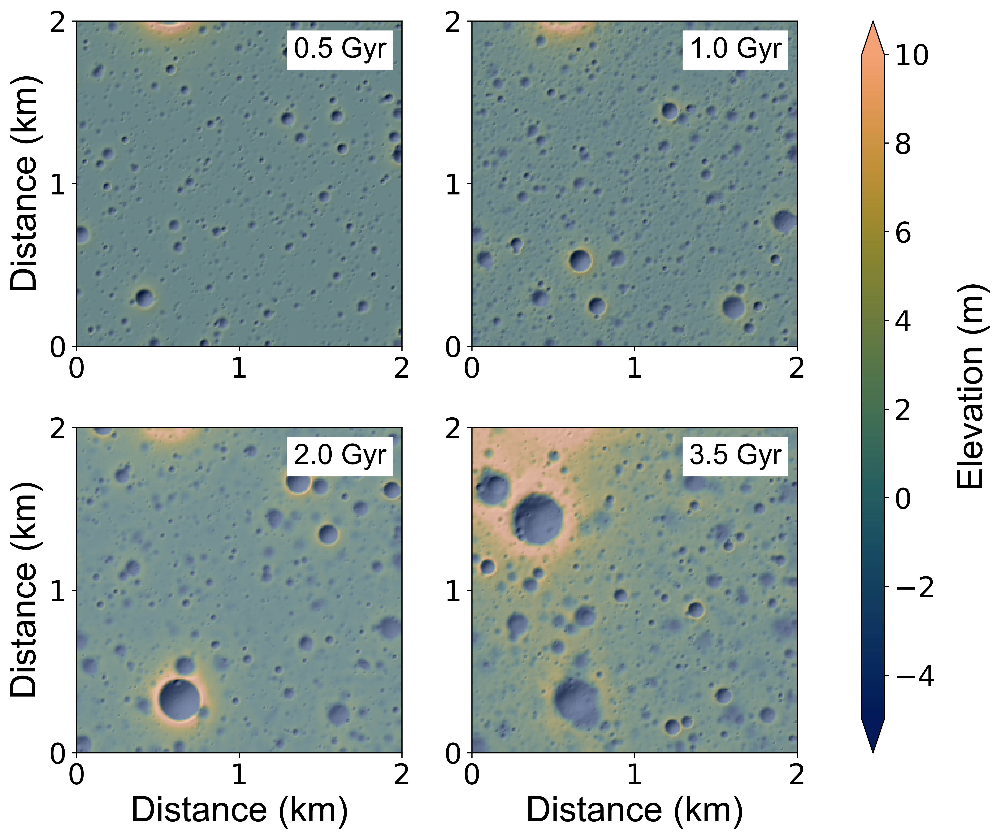

# 3LEVaTR
## 3D Landscape-EVolution and TRansport model for airless bodies 

### Overview
The 3LEVaTR model simulates the surface of an airless body evolving over under the effects of macroscopic impact cratering and topographic diffusion from micrometeorite bombardment. The rate of micrometeorite diffusion is calibrated so that the roughness of a typical output synthetic landscape matches that of the real planetary body (at the same scale).

### Impact cratering 
Impacts are randomly sampled from the inner solar system fluxes of Marchi et al. (2009). Using a Poisson random number generator, we determine all global impacts that occur during each timestep. Each impact is converted to final crater dimensions using the pi-group scaling method (Holsapple & Housen, 2007). Craters that overlap the model domain (represented as a grid of cells storing elevation at each timestep) are added as geometric elevation profiles. Off-grid impacts are monitored for secondary crater production, since large nearby impacts can produce secondary fragments that will impact the model domain. 

### Topographic diffusion
Small impacts that occur on local topographic slopes will preferentially eject material further in the downhill direction than uphill. This slope-dependent transport process gives rise to topographic degradation due to the steady stream of micrometeorites that constantly bombards planetary bodies lacking an atmosphere to filter out these small impactors. The cumulative effect of many micrometeorite impacts can be modeled as a diffusive erosion process. At each timestep, we apply the 2D diffusion equation to the model domain and compute the elevation change at each pixel as a result of this process. We developed an alternating-direction implicit scheme that is unconditionally stable for any timestep or grid resolution, following the methods outlined in Pelletier (2008).
